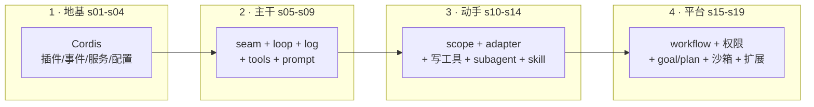

# 四阶段 Layers

四层边界图。每层讲清「学完的标志」和「怎么自查」。

<Reveal>

</Reveal>

## 每层的「学完标志」

### 1 · 地基（s01-s04）

- 读得懂 `examples/headless-agent/cordis.yml` 的每一行
- 能写出插件 + `Service` + `ctx.on` + `Config`
- **自查**：插件没反应时，第一反应是查 fiber 是不是 PENDING

### 2 · 主干（s05-s09）

- 能手绘 turn flow 时序图
- 说清「模型可见⟺已记录」这条铁律
- 讲清一个 seam 的三角色
- **自查**：不看文档，画出 `pre-execute→execute→post-execute→result` 管线

### 3 · 动手（s10-s14）

- 从零写一个带 `presentation` 的最小工具，跑通管线
- 说清 scope「不继承到子 agent」对 subagent 意味着什么
- **自查**：解释 `ctx.shell.run(ctx.shell.resolve(request))` 为什么不能写成 `run(request)`

### 4 · 平台（s15-s19）

- 能设计一条新的 capability seam 并解释三角色
- 说清 workflow / Ralph / goal 三者的区别
- **自查**：解释 HMR 为什么「免费」（s01 的 effect + s03 的依赖加载）

## 层与层之间的「桥」

每一层末尾都有「停下来自己重建」的提示。重建不是复述——是**关掉文档，自己写一遍最小版本**。写不出来，就说明那一层还没吃透，回退到复位点。
