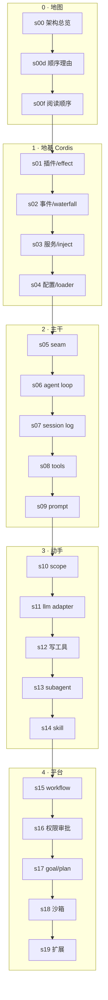

# 主线 Timeline

一条线看全 19 章 + 地图。箭头表示「学习依赖」——读后面的章节前，前面的必须先懂。

<AnimatedTimeline />

> 上图是**动态主线**：节点按学习依赖顺序逐个点亮，悬停看细节、点击跳到对应章节。
> 下面再给一份静态 mermaid 一图流，方便你一眼看全。

## 每章的「升级」

| # | 章节 | 你新增的能力 |
|---|---|---|
| s00 | 架构总览 | 全系统地图：profiles/bundles、七核心服务、turn flow、seam |
| s01 | Cordis 地基 | 插件 = `apply(ctx)`；effect 可撤销；fiber 状态机 |
| s02 | 事件与 waterfall | 五种分发模式；`next()` 委托 vs 短路 veto |
| s03 | 服务与依赖注入 | `Service`/`inject`/`ctx.get`；依赖驱动加载 |
| s04 | 配置与 Loader | `Config` schema 校验；`cordis.yml`；HMR 为什么免费 |
| s05 | Capability Seam | Definition/Provider/Consumer 三角色 |
| s06 | Agent Loop | turn/step/round；一步一模型的时序 |
| s07 | Session Log | 模型可见⟺已记录；`deriveMessages` |
| s08 | Tools | `ToolDefinition`；pre→execute→post→result 管线 |
| s09 | Prompt Assembly | section 分节；tool schema 注入 |
| s10 | Scope | 每 agent 注册空间；shadowing；不继承 |
| s11 | LLM Adapter | `LlmAdapter`；`Message`/`StreamChunk` 词汇 |
| s12 | 写一个工具 | `defineTool`；presentation/execute 全流程 |
| s13 | Subagent | 委派 seam；lineage 谱系 |
| s14 | Skill | 目录加载；按需 `inject()` |
| s15 | Workflow | 多 agent 编排 |
| s16 | 权限与审批 | `tools/pre-execute` 门；approval；hooks |
| s17 | Goal 与 Plan | 同会话目标；plan mode |
| s18 | 沙箱与执行世界 | sandbox/fs 共享执行世界 |
| s19 | 扩展与自修改 | extensions；HMR 收束 |

## 复位点

读到中间模糊，回 [glossary](/docs/glossary) → [data-structures](/docs/data-structures) → 卡住那章的前一章。
